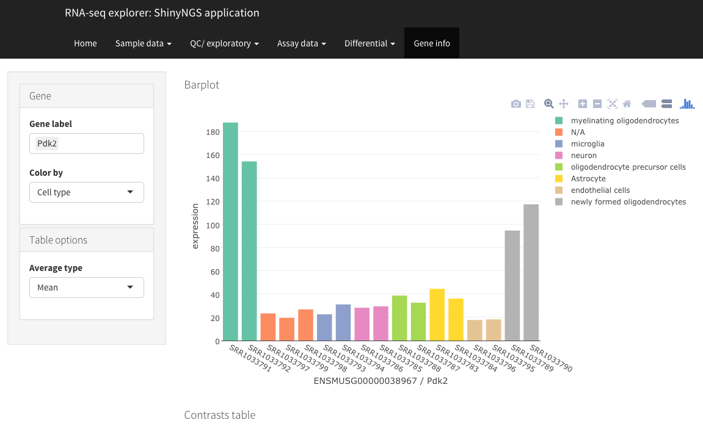

<!-- README.md is generated from README.Rmd. Please edit that file -->
Synopsis
========

This is a package designed to facilitate downstream analysis of RNA-seq and similar expression data with various exploratory plots. It's a work in progress, with new features added on a regular basis.

Screenshot
==========



Objectives
----------

-   Allow rapid exploration of data output more or less straight from RNA-seq piplelines etc.
-   Where more parameters are provided, extend the exploratory tools available - e.g. for differential expression.

Features
--------

-   A variety of single and multiple-panel Shiny applications- currently heatmap, pca, boxplot, dendrogram, gene-wise barplot, various tables and an RNA-seq app combining all of these.
-   Leveraging of libraries such as [DataTables](https://rstudio.github.io/DT/) and [Plotly](https://plot.ly/) for rich interactivity.
-   Takes input in an extension of the commonly used `SummarizedExperiment` format, called `ExploratorySummarizedExperiment`
-   Interface kept simple where possible, with complexity automatically added where required:
    -   Input field clutter reduced with the use of collapses from [shinyBS](https://ebailey78.github.io/shinyBS/index.html) (when installed).
    -   If a list of `ExploratorySummarizedExperiment`s is supplied (useful in situiations where the features are different beween matrices - e.g. from transcript- and gene- level analyses), a selection field will be provided.
    -   If a selected experiment contains more than one assay, a selector will again be provided.
-   For me: leveraging of [Shiny modules](http://shiny.rstudio.com/articles/modules.html). This makes re-using complex UI components much easier, and maintaining application code is orders of magnitude simpler as a result.

Installation
============

Prerequisites
-------------

`shinyngs` relies heavily on `SummarizedExperiment`. Formerly found in the `GenomicRanges` package, it now has its own package on Bioconductor: <http://bioconductor.org/packages/release/bioc/html/SummarizedExperiment.html>. This requires a recent version of R.

Graphical enhancements are provided by `shinyBS` and `shinyjs`

### Browser

**Strong recommendation for Chrome over Firefox** - everything renders much more nicely.

Install with devtools
---------------------

At time of writing, the most recent CRAN version of Plotly [was problematic](http://community.plot.ly/t/evaluate-broken-in-recent-versions-of-r-api/1060). I recommend using [the most recent dev version from GitHub](https://github.com/ropensci/plotly)

``` r
devtools::install_github("ropensci/plotly", upgrade_dependencies = FALSE)
install_github('pinin4fjords/shinyngs', upgrade_dependencies = FALSE)
```

Example
=======

An example `ExploratorySummarizedExperimentList` based on the Zhang et al study of neurons and glia (<http://www.jneurosci.org/content/34/36/11929.long>) is included in the package, and this can be used to demonstrate available features.

``` r
library(shinyngs)
data("zhangneurons")

app <- prepareApp("rnaseq", zhangneurons)
shiny::shinyApp(app$ui, app$server)
```

There's lots more information and examples of how to build your own apps in the [vignette](http://htmlpreview.github.io/?https://github.com/pinin4fjords/shinyngs/blob/master/inst/doc/shinyngs.html).

TODO
====

-   Tidy up out-of-date function documentation
-   Add tables for gene sets, read statistics etc
-   Incorporate some more fundamental QC plots
-   More apps for more things!

Contributors
============

This is an experimental embryonic project, but I can be reached on @pinin4fjords with any queries. Other contributors welcome.

License
=======

MIT
